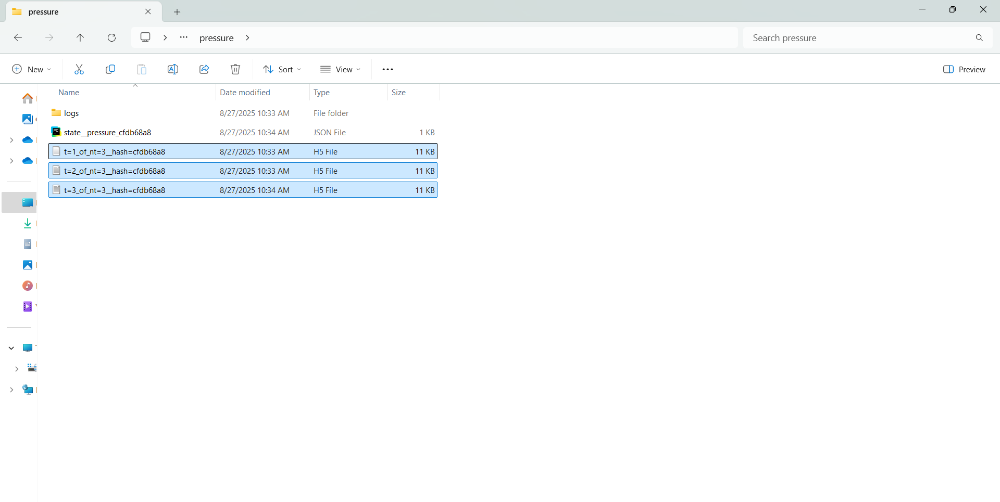

# TurbData Manager (TDM)

**TurbData Manager (TDM)** is a Python-based application for managing **large-scale turbulence datasets** from the [Johns Hopkins Turbulence Database (JHTDB)](http://turbulence.pha.jhu.edu/).  
It provides a **PyQt6 graphical interface** and a modular backend that enables researchers and engineers to query, organize, and resume downloads of multi-gigabyte datasets for **CFD and machine learning research**.


**Pre-Release Notice**  
This project is currently in **pre-release development**.  
It is not production ready, and features may change significantly before the first stable release.

**Authentication**
An API token is **required** to use the JHTDB.  
This project does **not** provide one — you must request your own from the [Johns Hopkins Turbulence Database](http://turbulence.pha.jhu.edu/).  
Once obtained, enter your token into the GUI when prompted.


## Features

- **PyQt6 GUI** for intuitive dataset creation, browsing, and file management
- **Resumable queries**: pause/resume long dataset downloads without data loss
- **Chunked queries** with adaptive retry logic to handle JHTDB limits
- **HDF5-ready storage structure** for scalable ML pipelines
- **Metadata-driven design**: dataset constraints, grid configs, and runtime configs are all serialized for reproducibility
- **Flexible session management**:
  - Create new dataset series with custom grid/time bounds
  - Load existing sessions and continue querying
  - Maintain a searchable log of all datasets


TurbData Manager (TDM) provides a PyQt6 graphical interface for managing turbulence dataset queries.
Below are some of the key windows and features:

## Main Window – Central control panel with session management, progress tracking, and live query status.


## New Session Dialog – Define dataset constraints, spatial-temporal bounds, and grid resolution before launching a query.


## Load Session Dialog – Browse and resume existing sessions with searchable metadata and dataset logs.


## Intuitive File Structure - Manageable file structure to easily find and use downloaded datasets.


 

## How Querying Works

TurbData Manager (TDM) converts a **large 4D dataset** (3D spatial volume × time) into manageable **spatial-temporal queries**.  
This allows multi-gigabyte turbulence datasets to be downloaded reliably and stored incrementally.  


### Querying Sequence
1. **User defines spatial-temporal bounds** (x, y, z, t) and resolution.  
2. The program splits the spatial domain into **subvolumes** (chunks).  
3. For each **temporal point**:
   - A new **HDF5 file** is created to represent that snapshot in time.  
   - The dataset is queried chunk by chunk.  
   - Each **spatial chunk** is immediately written to its correct location inside the HDF5 file (no need to hold the entire dataset in memory).  
4. The process repeats for every time index until the entire spatial-temporal volume is complete.  
5. If paused or interrupted, TDM resumes from the last completed chunk or temporal file.  

### Key Concepts
- **Spatial-Temporal Points**: Each dataset consists of millions of points in (x, y, z, t) space.  
- **Chunks**: Subdivisions of the 3D spatial domain that fit within API request limits.  
- **HDF5 Snapshots**: Each `.h5` file corresponds to **one temporal point**. It contains all spatial chunks stitched together into a complete 3D field.  
- **Resume Capability**: Because chunks are written directly to disk, the query can pause/resume without losing progress.  


## Attribution
This project makes use of the Johns Hopkins Turbulence Database (JHTDB) 
API and related tools, © Johns Hopkins University. Those components are 
licensed separately under the Apache License, Version 2.0. All rights to 
JHTDB code remain with their original authors.


# Quick Start
```bash
# Clone the repository
git clone https://github.com/<your-username>/TurbData-Toolkit.git
cd TurbData-Toolkit

# Create a virtual environment (recommended)
python -m venv .venv
source .venv/bin/activate   # (Linux/Mac)
.venv\Scripts\activate      # (Windows)

# Install dependencies
pip install -r requirements.txt

# Run the GUI
python src/Controllers/MainWindowController.py


==============================================
==	      Project Structure                 ==
==============================================
TurbData-Manager/
├── src/                    # Source code
│   ├── Controllers/        # PyQt6 GUI controllers
│   │   ├── MainWindowController.py
│   │   ├── NewSessionDialog.py
│   │   └── LoadSessionDialog.py
│   ├── main/            # Core logic
│   │   ├── query_manager.py
│   │   ├── file_manager.py
│   │   ├── supplementary_classes.py
│   │   └── query_session.py
│   └── ui/                 # Qt Designer UI files (or generated Python)
├── examples/               # Demo scripts (coming soon)
├── docs/                   # Documentation (coming soon)
├── requirements.txt        # Python dependencies
├── LICENSE                 # License file
└── README.md               # This file
